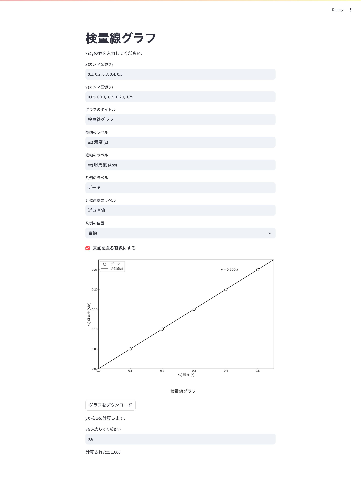

## Streamlitアプリケーションの実行

### インストール


```sh
pip install -r requirements.txt
```

### アプリケーションの実行

以下のコマンドを実行してStreamlitアプリケーションを起動します。

```sh 
streamlit run app.py
```

### 使用方法

1. Webブラウザが自動的に開き、アプリケーションが表示されます。
2. 濃度xと測定値(y)のデータを入力します。
3. 検量線が描画され、グラフを画像としてダウンロードすることができます。
4. 測定値(y)を入力して、対応する濃度を計算します。

### ファイル構成

- `app.py`: Streamlitアプリケーションのメインスクリプト
- `requirements.txt`: 必要なパッケージのリスト

### 外観
